# Тестування працездатності системи

*В цьому розділі необхідно вказати засоби тестування, навести вихідні коди тестів та результати тестування.*
*Тестування виконується за допомогою Postman*

## Запуск сервера

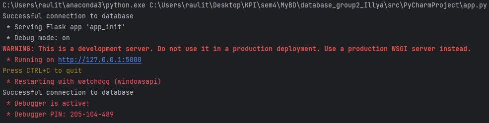

## Тестування GET

### Отримати всіх користувачів

#### Запит:
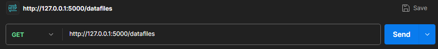

#### Результат:
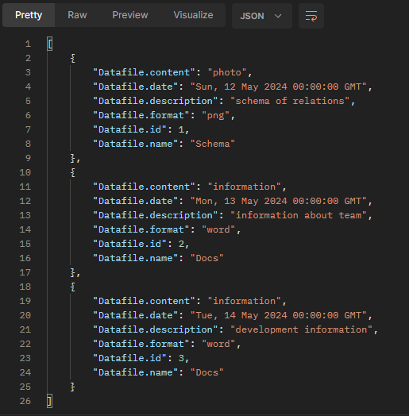

### Отримати користувача по id

#### Запит:
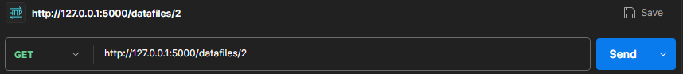

#### Результат:
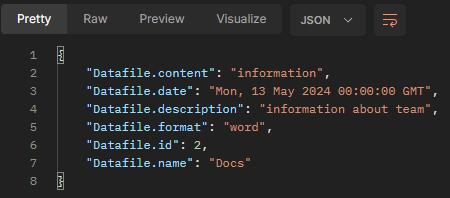

## Тестування POST

### Додати користувача

#### Запит:
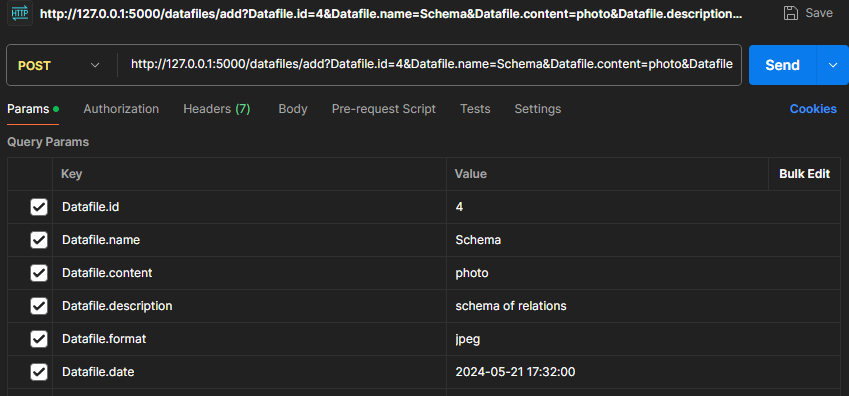

#### Результат:
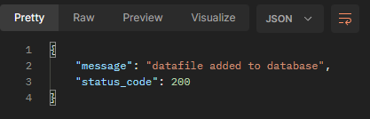

#### Перевірка за допомогою GET:
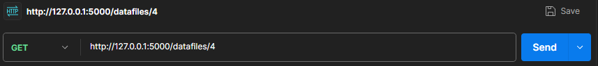

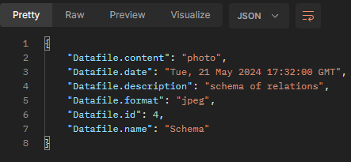

## Тестування PUT

### Змінити користувача по id

#### Запит:
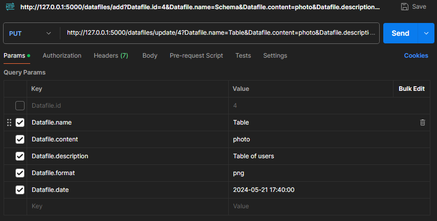

#### Результат:
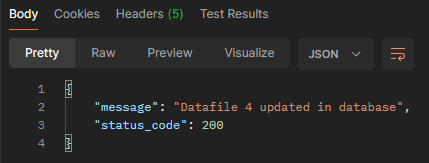

#### Перевірка за допомогою GET:
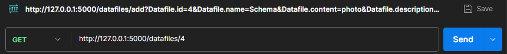

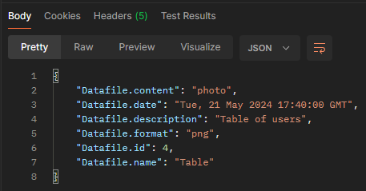

## Тестування DELETE

### Видалити користувача по id

#### Запит:
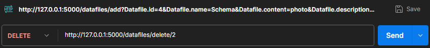

#### Результат:
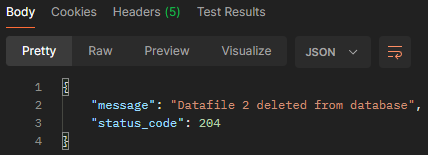

#### Перевірка за допомогою GET:
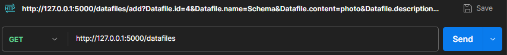

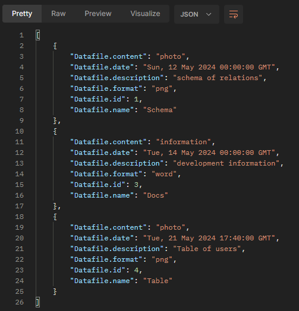
